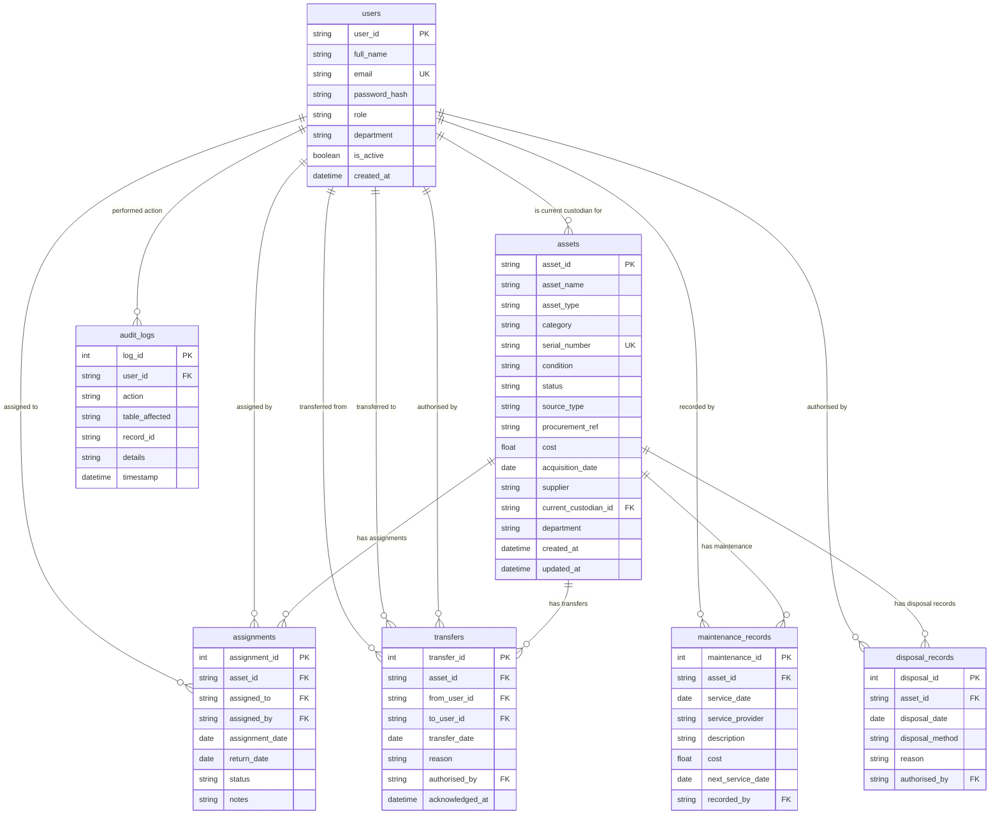

# URSB Asset Management System

A monorepo containing a React + TypeScript frontend and a FastAPI backend for managing assets.

## Prerequisites

- **Node.js** >= 18
- **Python** >= 3.11

## Project Structure

```
ursb_asset_mgt/
├── backend/
│   ├── alembic/            # Database migration scripts
│   ├── app/
│   │   ├── api/v1/        # API route handlers
│   │   ├── models/        # Data models
│   │   ├── schemas/       # Pydantic schemas
│   │   ├── services/      # Business logic
│   │   └── db.py          # Database connection & session config
│   ├── .env               # Backend environment variables (not committed)
│   ├── .env.example       # Backend environment variable template
│   ├── alembic.ini        # Alembic migration configuration
│   ├── requirements.txt   # Python dependencies
│   └── venv/              # Python virtual environment (not committed)
├── frontend/
│   ├── src/
│   │   ├── components/common/  # Shared UI components
│   │   ├── context/            # React context providers
│   │   ├── features/           # Feature modules (assets, auth, users)
│   │   ├── hooks/              # Custom React hooks
│   │   ├── services/           # API service layer
│   │   └── utils/              # Utility functions
│   ├── .env.example       # Frontend environment variable template
│   ├── index.html
│   ├── package.json
│   └── vite.config.ts
└── README.md
```

## Getting Started

### Backend

1. Navigate to the backend directory:
   ```bash
   cd backend
   ```

2. Create and activate a Python virtual environment:
   ```bash
   python -m venv venv
   # Windows
   venv\Scripts\activate
   # Linux/macOS
   source venv/bin/activate
   ```

3. Install dependencies:
   ```bash
   pip install -r requirements.txt
   ```

4. Copy the environment template and fill in values:
   ```bash
   cp .env.example .env
   ```

5. Run database migrations:
   ```bash
   alembic upgrade head
   ```
   This creates/updates the database schema. The SQLite file (`ursb_asset.db`) is created automatically in the `backend/` directory.

6. Run the development server:
   ```bash
   uvicorn main:app --reload --port 8000
   ```
   The API will be available at [http://localhost:8000](http://localhost:8000).  
   Interactive docs at [http://localhost:8000/docs](http://localhost:8000/docs).

### Database Migrations

| Command | Description |
|---|---|
| `alembic upgrade head` | Apply all pending migrations |
| `alembic downgrade -1` | Roll back the last migration |
| `alembic revision --autogenerate -m "description"` | Generate a new migration from model changes |
| `alembic current` | Show the current migration revision |
| `alembic history` | Show migration history |

### Frontend

1. Navigate to the frontend directory:
   ```bash
   cd frontend
   ```

2. Install dependencies:
   ```bash
   npm install
   ```

3. Copy the environment template and fill in values:
   ```bash
   cp .env.example .env
   ```

4. Run the development server:
   ```bash
   npm run dev
   ```
   The app will be available at [http://localhost:5173](http://localhost:5173).

## Environment Variables

### Backend (`backend/.env`)

| Variable | Description | Default |
|---|---|---|
| `APP_NAME` | Application name | `URSB Asset Management` |
| `DEBUG` | Enable debug mode | `true` |
| `CORS_ORIGINS` | Allowed CORS origins (comma-separated) | `http://localhost:5173` |
| `DATABASE_URL` | SQLAlchemy database URL | `sqlite:///./ursb_asset.db` |

### Frontend (`frontend/.env`)

| Variable | Description | Default |
|---|---|---|
| `VITE_API_BASE_URL` | Backend API base URL | `http://localhost:8000` |

## Database Entity Relationship Diagram (ERD)


